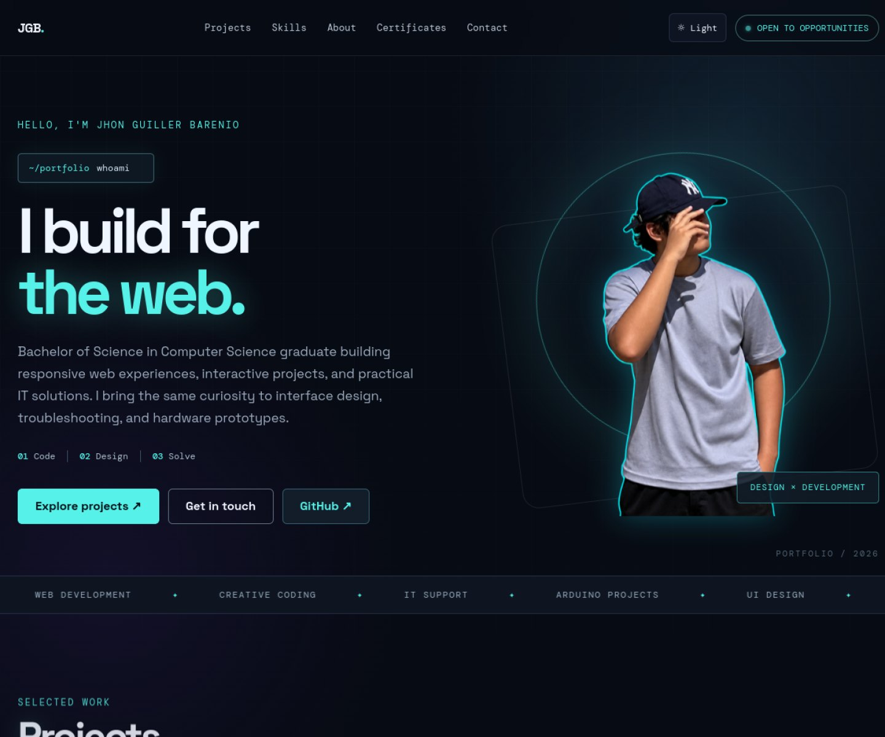

# Jhon Guiller Barenio — Portfolio

A personal portfolio showcasing my web projects, technical skills, and background as a Bachelor of Science in Computer Science graduate.



## Live portfolio

[Visit my portfolio](https://jhon-guiller-barenio-portfiolio-v2.vercel.app/)

## Featured projects

- **VERSA Learning** — [Open live site](https://versa-learning.vercel.app/)
- **Chessroom** — [Open live site](https://chessroom-source.vercel.app/)
- **Café Noir** — [Open website](https://cafe-noir-xi.vercel.app/) · [Admin panel](https://cafe-noir-xi.vercel.app/admin)
- **Arduino Smart Fan** — An indoor prototype that reads temperature with an LM35 sensor and adjusts fan speed through an L293D driver.

## Portfolio features

- Responsive layout for desktop and mobile
- Dark and muted light themes, with the selected theme saved in the browser
- Animated background and section reveal effects
- Project, skills, about, certificates, and contact sections

## Built with

- HTML
- CSS
- JavaScript
- Google Fonts: Space Grotesk and DM Mono

## Run locally

This is a static website and does not need a build step.

1. Clone this repository:
   ```bash
   git clone https://github.com/jhon-guiller-barenio/personal-portfolio-v2.git
   cd personal-portfolio-v2
   ```
2. Start a local server:
   ```bash
   python -m http.server 8000
   ```
3. Open [http://localhost:8000](http://localhost:8000) in your browser.

## Contact

Email: [jhonguillerbarenio@gmail.com](mailto:jhonguillerbarenio@gmail.com)  
GitHub: [jhon-guiller-barenio](https://github.com/jhon-guiller-barenio)
